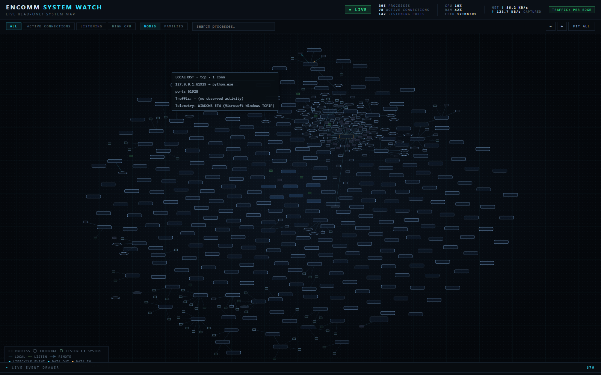

# ENCOMM SYSTEM WATCH

A **local-first, read-only observability map** for Windows 11. Processes,
agents, watchers, services and their real network connections are visualized
as a living topology graph — a dark, dense, control-room-style map of what the
machine is actually doing, in real time.

> The graph is the product. This is **not** a traditional metrics dashboard.

```
Chrome ────────────▶ External 104.x.x.x:443
   │
   └──────────────▶ Hermes ──────▶ 127.0.0.1:1234 ──────▶ LM Studio
                                                              │
                                                              └──▶ GPU
```

When real activity is detected (a connection opens, a process starts), the
corresponding edge **pulses** with a traveling signal. No fake data, no
invented relationships — only what the Windows socket table and process table
actually show.

---

## Screenshot


*(placeholder — replace with a capture of the live map)*

## Quick start (Windows 11)

Requirements: **Python 3.11+**, **Node.js 18+** (Node 22 recommended).

```powershell
# one-time setup
cd "C:\Users\xampos\Desktop\Encomm SYSTEM WATCH"
cd backend ; python -m venv .venv ; .\.venv\Scripts\python.exe -m pip install -r requirements.txt ; cd ..
cd frontend ; npm install ; cd ..

# development launcher (starts backend + frontend, localhost only)
powershell -ExecutionPolicy Bypass -File .\start-dev.ps1

# → frontend  http://localhost:5173   (Vite dev server, proxies /api and /ws)
# → backend   http://127.0.0.1:8765   (FastAPI + collector loop)
```

### Manual startup

```powershell
# backend (terminal 1)
cd backend
.\.venv\Scripts\python.exe -m uvicorn app.main:app --host 127.0.0.1 --port 8765

# frontend (terminal 2)
cd frontend
npm run dev
```

### Production-style single process

```bash
cd frontend && npm run build     # → frontend/dist
cd ../backend && .\.venv\Scripts\python.exe -m uvicorn app.main:app --host 127.0.0.1 --port 8765
# open http://127.0.0.1:8765  (backend serves the built UI)
```

## Architecture

```
WINDOWS 11
   ▼
SYSTEM COLLECTORS ── Processes · CPU/RAM · TCP/UDP sockets
   ▼
NORMALIZED SYSTEM STATE   (stable IDs: proc:<pid>:<create_time_ms>)
   ▼
TOPOLOGY ENGINE ── nodes (PROCESS/SYSTEM/EXTERNAL_ENDPOINT/LISTENING_PORT/LOCAL_ENDPOINT)
                   + evidence-based edges, capped & aggregated
   ▼
DIFF / EVENT ENGINE ── PROCESS_STARTED/STOPPED, CONNECTION_OPENED/CLOSED,
                       PROCESS_METRICS_UPDATED (throttled)
   ▼
FASTAPI + WEBSOCKET ── full snapshot on connect, then events + stats
   ▼
REACT + TYPESCRIPT ── Cytoscape graph, canvas pulse overlay, inspector,
                      event drawer, filters
```

See [docs/ARCHITECTURE.md](docs/ARCHITECTURE.md) and [docs/PHASES.md](docs/PHASES.md).

## What it shows (all real)

- **Processes** — every accessible process: name, PID, stable ID, exe, user,
  status, CPU %, RAM, threads, parent PID, start time, command line.
  Inaccessible/vanishing processes are skipped without crashing the loop.
- **TCP + UDP sockets** — classified as:
  - `LISTENING` (bound port → `LISTENING_PORT` node)
  - `LOCALHOST` (both ends on loopback → **process-to-process edge** when both
    sides can be mapped)
  - `EXTERNAL` (remote endpoint → `EXTERNAL_ENDPOINT` node per IP, capped with
    overflow aggregation)
- **Live events** — process start/stop, connection open/close, throttled
  metric updates. Real events drive real pulses on the edges.
- **Machine metrics** — overall CPU/RAM in the header, per-process CPU/RAM on
  nodes and in the inspector.

## UI

- Fullscreen dark topology canvas (zoom / pan / fit)
- Compact process cards: `name / PID / CPU / RAM`
- **Live signal pulses** — traveling particles on edges with real events;
  recently-active edges keep a subtle flow; closed connections fade out
- **LIVE EVENT DRAWER** — bounded 800-event chronological feed
- **Node inspector** — read-only details on click (no control buttons anywhere)
- Filters: ALL · ACTIVE CONNECTIONS · LISTENING · HIGH CPU; process search
- Honest status: `● LIVE` / `● CONNECTING` / `● DISCONNECTED`, auto-reconnect

## Read-only guarantee

ENCOMM SYSTEM WATCH can only **OBSERVE · COLLECT · CLASSIFY · DIFF · STREAM ·
VISUALIZE**. There is no code path — API route, UI control, or script — that
kills processes, restarts services, edits the registry/firewall, executes
arbitrary shell commands, or modifies anything. The UI has zero control
buttons.

## Security model

- Backend binds to **127.0.0.1 only** (configurable via `ESW_HOST`, never
  `0.0.0.0` by default)
- No analytics, no cloud telemetry, no external SaaS, no secrets in the
  frontend
- Frontend talks only to the local backend (same-origin or Vite proxy)

## Demo mode

All data is real by default. A synthetic collector exists strictly for
frontend development and is **off by default**:

```powershell
$env:ESW_DEMO_MODE = "1"   # then start the backend
```

When active, the backend flags every snapshot as `demo` and the UI shows an
amber **DEMO MODE** badge.

## Permissions

- No administrator rights required for basic collection. Some protected
  processes (elevated/system) return partial metadata or are skipped — the
  collector handles this silently.
- `psutil.net_connections()` may need elevation on some systems to see
  sockets owned by elevated processes; the collector degrades gracefully
  (per-family fallback, `pid=None` sockets attributed to the SYSTEM node).
- **Per-edge byte telemetry (Tier 2) requires an Administrator backend.**
  The real `Microsoft-Windows-TCPIP` ETW provider is access-denied for
  unelevated processes; SYSTEM WATCH never auto-elevates — an unelevated
  backend truthfully reports Tier 0 (socket lifecycle + adapter totals)
  and `elevation_required=true`. Run the backend from an elevated
  PowerShell to enable real per-edge traffic (verified end-to-end in
  v0.2.2 with `tools/verify_tier2.ps1`).

## Backend tests

```powershell
cd backend
.\.venv\Scripts\python.exe -m pytest tests -q
```

## Frontend build / typecheck

```bash
cd frontend
npm run build        # tsc --noEmit && vite build
npm run typecheck
```

## Acceptance driver

`tools/acceptance.mjs` runs the full A–K acceptance suite (startup, real
processes, process start/stop, network, connection pulses, inspector, event
drawer, WebSocket recovery, resilience) against a headless Chromium:

```bash
# backend + frontend running, then:
"<path>\brave.exe" --headless=new --remote-debugging-port=9222 `
  --user-data-dir="$env:TEMP\esw-cdp" --remote-allow-origins=* about:blank
node tools/acceptance.mjs        # exit 0 = all tests passed
```

## Known limitations

- **Connection establishment ≠ packet traffic.** Pulses fire on real
  `CONNECTION_OPENED/CLOSED` events from socket-table diffs. Real
  per-edge byte traffic (direction + bytes + PID per connection) comes
  from the elevated ETW Tier 2 provider (v0.2.2+, metadata only — never
  payloads); without an elevated backend only lifecycle and adapter
  totals are shown.
- Windows exposes limited parent-of-socket information; unpaired loopback
  sockets appear as `LOCAL_ENDPOINT` nodes rather than guessed pairs.
- The full-metadata first pass takes ~8s on a busy desktop; steady-state
  collector ticks are ~0.6–1s.
- Listening sockets show the raw bound address (e.g. `0.0.0.0:5355`).

## Roadmap

See [docs/PHASES.md](docs/PHASES.md) — Phases 1–12 functional; Windows
Services, Docker/WSL, GPU/VRAM telemetry, AI-agent observability (Hermes,
DeepSeek, LM Studio, MCP servers, tokens/TPS/latency) are designed-for and
scheduled next.

## Repository

- Local project: `C:\Users\xampos\Desktop\Encomm SYSTEM WATCH`
- GitHub: https://github.com/Xamposs/Encomm_System_Watch
- Branch: `main`
